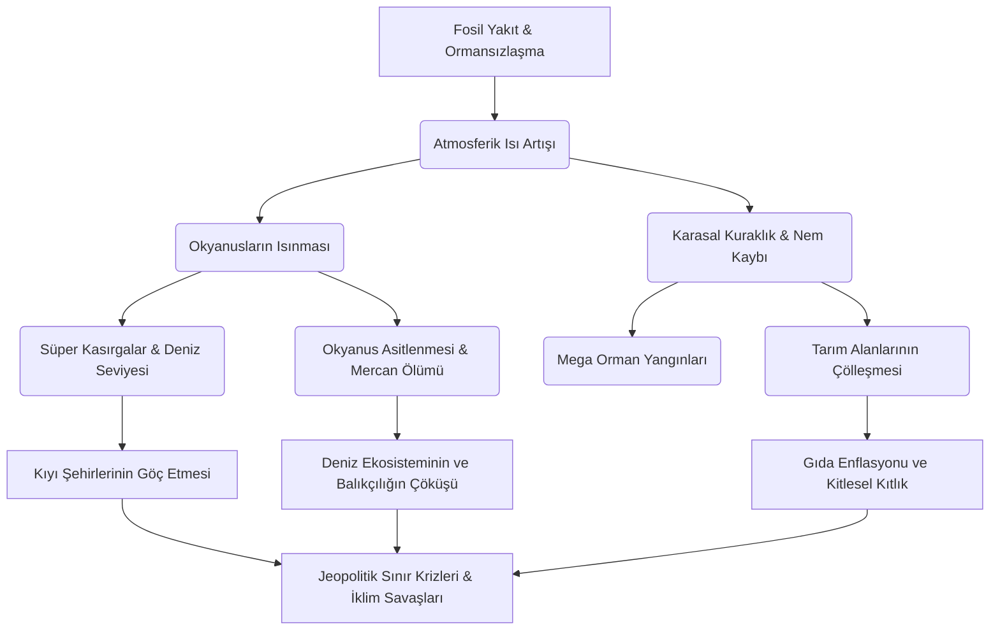

# iclim-changing
iclim changing

# 🌍 İklim Değişikliği ve Antroposen Çağı Küresel Kriz Atlası


İklim değişikliği, salt bir çevre sorunu değil; küresel ekonomiyi, jeopolitik dengeleri, halk sağlığını ve biyolojik çeşitliliği tehdit eden **sistematik ve çok boyutlu bir varoluş krizidir**. Bu doküman, insan faaliyetlerinin yeryüzü üzerindeki yıkıcı etkilerini, geri besleme mekanizmalarını ve kurtuluş senaryolarını en ince ayrıntısına kadar incelemektedir.

---

## ☀️ 1. Sera Etkisi ve Radyaktif Zorlama Mekanizması

Gezegenimizin enerji bütçesi, gelen güneş radyasyonu ile uzaya geri yansıyan kızılötesi radyasyon arasındaki dengeye (Termodinamik Denge) dayanır. İnsan kaynaklı sera gazı birikimi, uzaya kaçması gereken ısıyı atmosferde hapsederek **Pozitif Radyaktif Zorlamaya** (Radiative Forcing) neden olur.

```text
               🌞 [ GÜNEŞ: Kısa Dalga Radyasyonu (~340 W/m²) ]
                     │
                     │  (Gelen görünür ışık ve UV)
                     ▼
       ┌──────────────────────────────┐
       │   ☁️  ☁️  Atmosfer Üst Sınırı ☁️  ☁️   │
       └──────────────┬───────────────┘
                      │
        ┌─────────────┴─────────────┐
        │  SERA GAZI BATTANİYESİ    │ ◄─── (CO₂, CH₄, N₂O, HFCs yoğunluğu)
        │  ░░░░░░░░░░░░░░░░░░░░░░░  │
        │   🔺                 🔻   │ ◄─── Isı Atmosferde Hapsedilir!
        └───│──────────────────│────┘
            │                  ▲
            │ (Kısa dalga      │ (Yeryüzünden yansıyan 
            │  yüzeyi ısıtır)  │  uzun dalgalı infrared ışınlar)
            ▼                  │
       🌎 [ YERYÜZÜ: Albedo Etkisi ile Geri Yansıtma Oranı %30 ]
```

---

## 📊 2. Makro-Ekolojik Göstergeler ve Tarihsel Trendler

Aşağıdaki tablo, Sanayi Devrimi öncesi (1750), yakın geçmiş ve günümüzün paleoklimatolojik ve meteorolojik verilerini karşılaştırmalı olarak sunmaktadır:

| Gösterge Metriği | Sanayi Öncesi (1750) | 2000 Yılı | Günümüz Verileri | 2050 Projeksiyonu (İşler Böyle Giderse) | Risk Seviyesi |
| :--- | :--- | :--- | :--- | :--- | :--- |
| **Atmosferik $CO_2$ Yoğunluğu** | 280 ppm | 370 ppm | **425+ ppm** | 550+ ppm | 🔴 Katastrofik |
| **Küresel Ortalam Sıcaklık Artışı**| 0.0 °C (Ref) | +0.6 °C | **+1.28 °C** | +2.4 °C - +3.1 °C | 🔴 Geri Döndürülemez |
| **Deniz Seviyesi Değişimi** | ±0 mm | +140 mm | **+230 mm** | +500 mm ila +1000 mm | 🟠 Yüksek |
| **Okyanus PH Seviyesi (Asitlik)** | 8.21 (Bazik) | 8.11 | **8.05 (%30 Artış)** | 7.95 (Resif Yok Oluşu) | 🔴 Katastrofik |
| **Kutup ve Buzul Kütlesi** | %100 (Ref) | %78 | **%54** | <%15 (Buzsuz Arktik Yazı) | 🔴 Geri Döndürülemez |

---

## 🔄 3. İklimsel Devrilme Noktaları (Tipping Points)

Sistem bir kez tetiklendiğinde, insan müdahalesi olmaksızın kendi kendini hızlandıran döngülere **Pozitif Geri Besleme Mekanizmaları** denir. İklim bilimcilerin en çok korktuğu 3 büyük kırılma noktası:

### 🟩 A. Albedo Etkisi Döngüsü
$$\text{Sıcaklık Artışı} \longrightarrow \text{Buzulların Erimesi} \longrightarrow \text{Yansıtıcı Yüzey Azalması (Koyu Deniz Ortaya Çıkar)} \longrightarrow \text{Daha Fazla Isı Emilimi} \longrightarrow \text{Daha Fazla Erime}$$

### 🟫 B. Permafrost (Donmuş Toprak) Bombası
Sibirya ve Alaska'daki donmuş topraklarda, atmosferdekinden katbekat fazla karbon ve metan sıkışmıştır. Bu topraklar eridiğinde milyarlarca ton **Metan ($CH_4$)** atmosfere salınarak küresel ısınmayı aniden pik yaptıracaktır.

### 🟦 C. AMOC (Atlantik Meridyenel Devrilme Sirkülasyonu) Çöküşü
Grönland'dan eriyen tatlı su, okyanus akıntı sistemlerini (Gulf Stream dahil) felç etme riskine sahiptir. Bu durum Kuzey Avrupa'da ani ve ekstrem soğumalara, ekvatorda ise ölümcül sıcaklıklara yol açacaktır.

---

## 🌲 4. Krizin Çok Boyutlu Zincirleme Etki Haritası

İklim krizi lineer değil, eksponansiyel ve ağ yapısında (Network Effect) ilerler:



---

## 🌋 5. Sera Gazlarının Kimyasal ve Etki Analizi

Küresel Isınma Potansiyeli (GWP), bir gazın $CO_2$'ye kıyasla atmosferde ne kadar ısı tuttuğunu gösterir.

*   **Karbondioksit ($CO_2$):** 
    *   *GWP:* 1 (Referans)
    *   *Atmosferde Kalma Süresi:* 300 - 1000 yıl
    *   *Kritik Kaynak:* Endüstriyel yanma, çimento üretimi, deforestasyon.
*   **Metan ($CH_4$):** 
    *   *GWP:* **28 - 36** (20 yıllık vadede 84 kat daha güçlü!)
    *   *Atmosferde Kalma Süresi:* 12 yıl
    *   *Kritik Kaynak:* Hayvancılık enterik fermantasyonu, çeltik tarlaları, kayaç gazı sondajları.
*   **Diazot Monoksit ($N_2O$):** 
    *   *GWP:* **265 - 298**
    *   *Atmosferde Kalma Süresi:* 114 yıl
    *   *Kritik Kaynak:* Azotlu gübreler, nitrik asit üretimi.
*   **Florlu Gazlar (HFCs, PFCs, $SF_6$):** 
    *   *GWP:* **1.000 - 23.500**
    *   *Atmosferde Kalma Süresi:* Birkaç haftadan 50.000 yıla kadar!
    *   *Kritik Kaynak:* Klima gazları, yarı iletken üretimi, elektrik yalıtımı.

---


İklim değişikliği, modern insanlığın karşı karşıya olduğu en büyük **varoluşsal tehdittir**. Bu doküman; küresel ısınmanın nedenlerini, mevcut ekolojik durumu, geleceğe yönelik projeksiyonları ve krizin önüne geçmek için atılması gereken makro/mikro adımları detaylandırmak amacıyla hazırlanmıştır.

---


Paris Anlaşması'nın **1.5°C** hedefini tutturmak için yıllık küresel emisyonların her yıl **%7.6** oranında azaltılması gerekmektedir.

[Mevcut Durum: 50 Milyar Ton CO2e] ──(Enerji Dönüşümü)──► [Yeşil Hidrojen] ──(Tarım Devrimi)──► [Net Sıfır 2050]
## 🛠️ 6. Teknolojik ve Makro Çözüm Yol Haritası

Paris Anlaşması'nın **1.5°C** hedefini tutturmak için yıllık küresel emisyonların her yıl **%7.6** oranında azaltılması gerekmektedir.


## 💻 7. Yazılımcılar İçin: Yeşil Kodlama (Green Computing)

Yazılım ve veri merkezleri, küresel elektrik tüketiminin yaklaşık **%2-3'ünden** sorumludur (bu oran havacılık sektörü ile eş değerdir). Bir geliştirici olarak karbon ayak izinizi azaltabilirsiniz:

- [ ] **Algoritmik Optimizasyon:** Zaman ve alan karmaşıklığını ($O(N^2)$'den $O(N \log N)$'e) düşürerek CPU döngülerini ve dolayısıyla sunucu enerji tüketimini azaltın.
- [ ] **Yeşil Hosting Seçimi:** Veri merkezini, sadece PUE (Power Usage Effectiveness) oranı düşük ve %100 yenilenebilir enerji kullanan sağlayıcılardan (AWS, GCP, Azure'un yeşil bölgeleri) seçin.
- [ ] **Veri Aktarımını Azaltın:** API yanıtlarını agresif şekilde önbelleğe alın (Caching), görsel ve asset boyutlarını modern formatlarla (WebP, AVIF) sıkıştırın.
- [ ] **Dark Mode Entegrasyonu:** OLED/AMOLED ekranlarda piksel bazlı enerji tasarrufu sağlamak için kullanıcı arayüzlerinde koyu tema desteği sunun.

---

## 📜 8. Kronolojik Küresel Mutabakatlar ve Durumları

1.  **1992 - UNFCCC (Rio Dünya Zirvesi):** İklim değişikliğine karşı küresel çaptaki ilk hükümetlerarası çerçeve sözleşmesi.
2.  **1997 - Kyoto Protokolü:** Sadece gelişmiş ülkelere yasal emisyon kotası koyduğu ve esnek mekanizmalar (karbon ticareti) getirdiği için küresel emisyon artışını durduramadı.
3.  **2015 - Paris Anlaşması:** Ulusal Katkı Beyanları (NDC) üzerine kurulu, tüm ülkeleri kapsayan, yüzyılın ortasına kadar net-sıfır emisyon hedefleyen mevcut en dinamik uluslararası hukuk aracı.
4.  **2019 - AB Yeşil Mutabakatı:** "Sınırda Karbon Düzenleme Mekanizması" (SKDM) ile AB'ye ihraç edilen ürünlerden karbon vergisi alınmasını öngören, ticareti yeşillendiren en sert yaptırım planı.

---

> 📢 **Bilimsel Konsensüs:** IPCC (Hükümetlerarası İklim Değişikliği Paneli) 6. Değerlendirme Raporu'na göre; küresel ısınmanın insan faaliyetlerinden kaynaklandığı artık bir "tartışma" değil, **kesin bir bilimsel gerçektir**.

