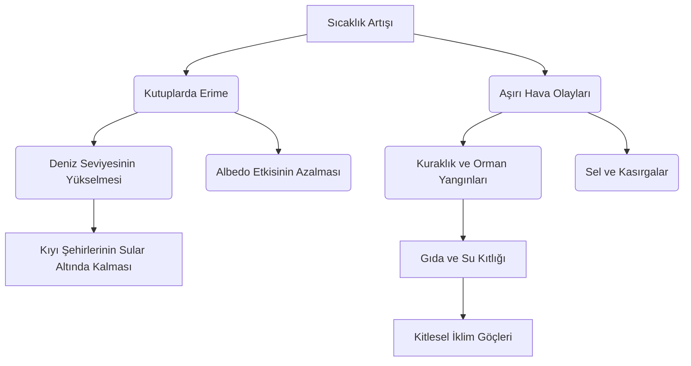

# iclim-changing
iclim changing

markdown# 🌍 İklim Değişikliği ve Küresel Kriz Rehberi


İklim değişikliği, modern insanlığın karşı karşıya olduğu en büyük **varoluşsal tehdittir**. Bu doküman; küresel ısınmanın nedenlerini, mevcut ekolojik durumu, geleceğe yönelik projeksiyonları ve krizin önüne geçmek için atılması gereken makro/mikro adımları detaylandırmak amacıyla hazırlanmıştır.

---

## ☀️ 1. Sera Etkisi Nasıl Çalışır? (Mekanizma)

Güneşten gelen kısa dalgalı ışınlar yeryüzünü ısıtır. Yeryüzünden geri yansıyan kızılötesi ışınlar ise atmosferdeki sera gazları (CO₂, CH₄, N₂O) tarafından tutularak gezegenin sıcak kalmasını sağlar. Ancak insan faaliyetleri bu gazların oranını artırarak yapay bir battaniye etkisi yaratmıştır.

```text
       🌞 [ GÜNEŞ ]
          │
          │ (Kısa Dalgalı Radyasyon)
          ▼
   ┌──────────────┐  ◄─── [ ATMOSFER ] (Yapay Sera Gazı Katmanı)
   │  ░░░░░░░░░░  │
   │ 🔺        🔻 │  ◄─── Isı hapsedilir (Küresel Isınma)
   └─│──────────│─┘
     │          ▲
     ▼          │ (Geri Yansıyan Kızılötesi Işınlar)
   🌎 [ YERYÜZÜ ]
```

---

## 📊 2. Mevcut Durum ve Göstergeler

Sanayi Devrimi'nden bu yana gezegenimizin temel iklim parametrelerindeki değişim aşağıdaki tabloda özetlenmiştir:

| Gösterge | Sanayi Öncesi Dönem | Günümüz Verileri | Durum / Trend |
| :--- | :--- | :--- | :--- |
| **Atmosferik $CO_2$** | ~280 ppm | **420+ ppm** | 📈 Hızla Yükseliyor |
| **Küresel Sıcaklık** | 0.0 °C (Referans) | **+1.25 °C** | 🚨 Kritik Sınıra Yakın |
| **Deniz Seviyesi** | 0 mm (Referans) | **+200 mm** | 🌊 Yükselme Hızı Arttı |
| **Arktik Buz Alanı** | ~7.5 Milyon $km^2$ | **~4.1 Milyon $km^2$**| 📉 Erime Kritik Seviyede |

---

## 🌲 3. Krizin Zincirleme Etki Ağacı

Küresel sıcaklık artışı tek bir sonucu değil, birbirini tetikleyen bir felaketler silsilesini doğurur:



---

## ⚡ 4. Temel Sera Gazları ve Kaynakları

*   **Karbondioksit ($CO_2$):** Fosil yakıt (kömür, petrol, doğalgaz) kullanımı, ormansızlaşma ve endüstriyel süreçler.
*   **Metan ($CH_4$):** Hayvancılık (özellikle büyükbaş), kontrolsüz atık depolama alanları, pirinç tarlaları ve doğalgaz sızıntıları.
*   **Azot Oksit ($N_2O$):** Yoğun yapay gübre kullanımı, endüstriyel tarım ve kimyasal üretim süreçleri.
*   **F-Gazları:** Soğutma sistemleri, klimalar ve bazı elektronik üretim süreçlerinde kullanılan yapay gazlar.

---

## 🛠️ 5. Çözüm Yol Haritası ve Eylem Planı

Küresel ısınmayı **1.5°C** sınırında tutabilmek için 2050 yılına kadar **Net Sıfır Emisyon** hedefine ulaşılması şarttır.

### 🏢 Makro Stratejiler
1.  **Enerji Dönüşümü:** Kömürlü termik santrallerin kapatılarak rüzgar, güneş ve jeotermal enerjiye geçilmesi.
2.  **Karbon Vergisi:** Kirleten öder prensibiyle emisyon üreten sektörlere ciddi mali yaptırımlar uygulanması.
3.  **Döngüsel Ekonomi:** Doğrusal "al-kullan-at" modelinden, geri dönüşüm ve yeniden kullanım odaklı sisteme geçiş.
4.  **Doğa Tabanlı Çözümler:** Devasa ağaçlandırma projeleri ve sulak alanların restorasyonu ile karbon yutak alanlarının artırılması.

### 👤 Bireysel Katkı Listesi
- [ ] **Enerji Verimliliği:** Evde LED ampuller kullanmak ve kullanılmayan cihazları fişten çekmek.
- [ ] **Sürdürüzebilir Ulaşım:** Toplu taşıma, bisiklet veya elektrikli araçları tercih etmek; uçak seyahatlerini azaltmak.
- [ ] **Beslenme Alışkanlığı:** Kırmızı et tüketimini azaltarak bitki bazlı beslenmeye ağırlık vermek (Metan emisyonunu düşürür).
- [ ] **Bilinçli Tüketim:** Yerel ürünleri tercih etmek, plastik kullanımını minimuma indirmek ve ileri dönüşüm yapmak.

---

## 📜 6. Önemli Uluslararası Anlaşmalar

*   **Kyoto Protokolü (1997):** Gelişmiş ülkelere emisyon azaltma yükümlülüğü getiren ilk yasal anlaşma.
*   **Paris Anlaşması (2015):** Küresel sıcaklık artışını sanayi öncesi döneme kıyasla **2°C'nin çok altında** tutmayı ve **1.5°C** ile sınırlandırmayı hedefleyen küresel mutabakat.
*   **Avrupa Yeşil Mutabakatı (2019):** Avrupa Kıtası'nı 2050 yılına kadar iklim-nötr hale getirmeyi amaçlayan kapsamlı büyüme stratejisi.

---

> 💡 **Unutmayalım:** "Bunun bir 'B Planı' yok çünkü gidebileceğimiz bir 'B Gezegeni' yok." – *Ban Ki-moon*
