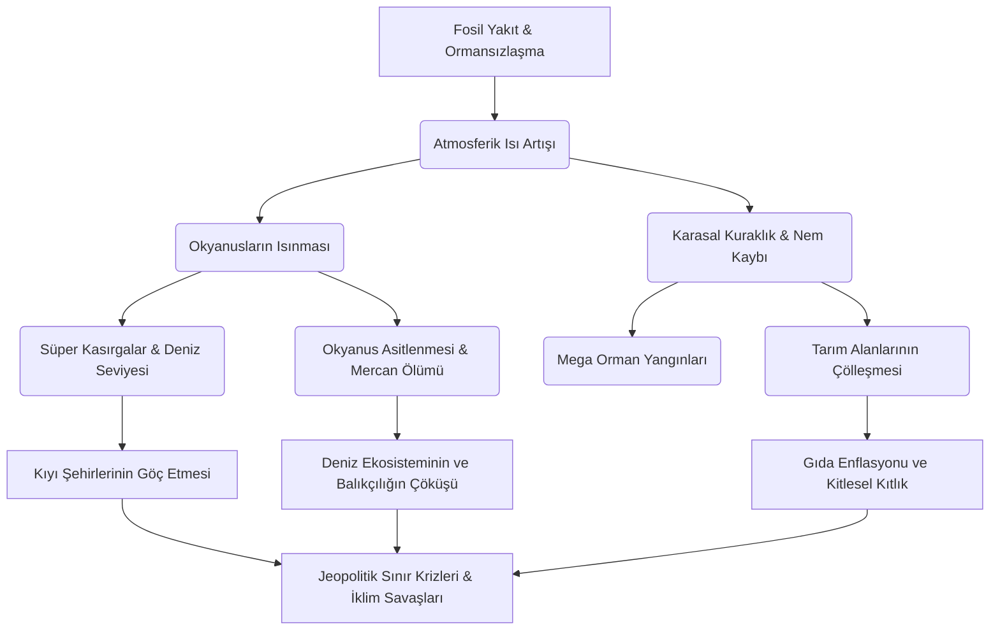
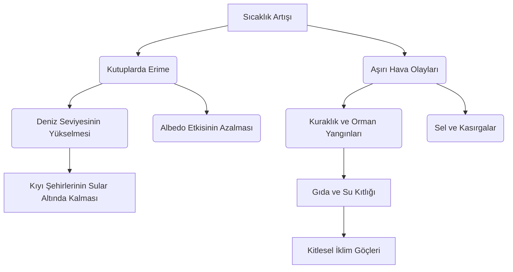

# iclim-changing
iclim changing

# 🌍 İklim Değişikliği ve Antroposen Çağı Küresel Kriz Atlası


İklim değişikliği, salt bir çevre sorunu değil; küresel ekonomiyi, jeopolitik dengeleri, halk sağlığını ve biyolojik çeşitliliği tehdit eden **sistematik ve çok boyutlu bir varoluş krizidir**. Bu doküman, insan faaliyetlerinin yeryüzü üzerindeki yıkıcı etkilerini, geri besleme mekanizmalarını ve kurtuluş senaryolarını en ince ayrıntısına kadar incelemektedir.

---

## ☀️ 1. Sera Etkisi ve Radyaktif Zorlama Mekanizması

Gezegenimizin enerji bütçesi, gelen güneş radyasyonu ile uzaya geri yansıyan kızılötesi radyasyon arasındaki dengeye (Termodinamik Denge) dayanır. İnsan kaynaklı sera gazı birikimi, uzaya kaçması gereken ısıyı atmosferde hapsederek **Pozitif Radyaktif Zorlamaya** (Radiative Forcing) neden olur.

```text
               🌞 [ GÜNEŞ: Kısa Dalga Radyasyonu (~340 W/m²) ]
                     │
                     │  (Gelen görünür ışık ve UV)
                     ▼
       ┌──────────────────────────────┐
       │   ☁️  ☁️  Atmosfer Üst Sınırı ☁️  ☁️   │
       └──────────────┬───────────────┘
                      │
        ┌─────────────┴─────────────┐
        │  SERA GAZI BATTANİYESİ    │ ◄─── (CO₂, CH₄, N₂O, HFCs yoğunluğu)
        │  ░░░░░░░░░░░░░░░░░░░░░░░  │
        │   🔺                 🔻   │ ◄─── Isı Atmosferde Hapsedilir!
        └───│──────────────────│────┘
            │                  ▲
            │ (Kısa dalga      │ (Yeryüzünden yansıyan 
            │  yüzeyi ısıtır)  │  uzun dalgalı infrared ışınlar)
            ▼                  │
       🌎 [ YERYÜZÜ: Albedo Etkisi ile Geri Yansıtma Oranı %30 ]
```

---

## 📊 2. Makro-Ekolojik Göstergeler ve Tarihsel Trendler

Aşağıdaki tablo, Sanayi Devrimi öncesi (1750), yakın geçmiş ve günümüzün paleoklimatolojik ve meteorolojik verilerini karşılaştırmalı olarak sunmaktadır:

| Gösterge Metriği | Sanayi Öncesi (1750) | 2000 Yılı | Günümüz Verileri | 2050 Projeksiyonu (İşler Böyle Giderse) | Risk Seviyesi |
| :--- | :--- | :--- | :--- | :--- | :--- |
| **Atmosferik $CO_2$ Yoğunluğu** | 280 ppm | 370 ppm | **425+ ppm** | 550+ ppm | 🔴 Katastrofik |
| **Küresel Ortalam Sıcaklık Artışı**| 0.0 °C (Ref) | +0.6 °C | **+1.28 °C** | +2.4 °C - +3.1 °C | 🔴 Geri Döndürülemez |
| **Deniz Seviyesi Değişimi** | ±0 mm | +140 mm | **+230 mm** | +500 mm ila +1000 mm | 🟠 Yüksek |
| **Okyanus PH Seviyesi (Asitlik)** | 8.21 (Bazik) | 8.11 | **8.05 (%30 Artış)** | 7.95 (Resif Yok Oluşu) | 🔴 Katastrofik |
| **Kutup ve Buzul Kütlesi** | %100 (Ref) | %78 | **%54** | <%15 (Buzsuz Arktik Yazı) | 🔴 Geri Döndürülemez |

---

## 🔄 3. İklimsel Devrilme Noktaları (Tipping Points)

Sistem bir kez tetiklendiğinde, insan müdahalesi olmaksızın kendi kendini hızlandıran döngülere **Pozitif Geri Besleme Mekanizmaları** denir. İklim bilimcilerin en çok korktuğu 3 büyük kırılma noktası:

### 🟩 A. Albedo Etkisi Döngüsü
$$\text{Sıcaklık Artışı} \longrightarrow \text{Buzulların Erimesi} \longrightarrow \text{Yansıtıcı Yüzey Azalması (Koyu Deniz Ortaya Çıkar)} \longrightarrow \text{Daha Fazla Isı Emilimi} \longrightarrow \text{Daha Fazla Erime}$$

### 🟫 B. Permafrost (Donmuş Toprak) Bombası
Sibirya ve Alaska'daki donmuş topraklarda, atmosferdekinden katbekat fazla karbon ve metan sıkışmıştır. Bu topraklar eridiğinde milyarlarca ton **Metan ($CH_4$)** atmosfere salınarak küresel ısınmayı aniden pik yaptıracaktır.

### 🟦 C. AMOC (Atlantik Meridyenel Devrilme Sirkülasyonu) Çöküşü
Grönland'dan eriyen tatlı su, okyanus akıntı sistemlerini (Gulf Stream dahil) felç etme riskine sahiptir. Bu durum Kuzey Avrupa'da ani ve ekstrem soğumalara, ekvatorda ise ölümcül sıcaklıklara yol açacaktır.

---

## 🌲 4. Krizin Çok Boyutlu Zincirleme Etki Haritası

İklim krizi lineer değil, eksponansiyel ve ağ yapısında (Network Effect) ilerler:



---

## 🌋 5. Sera Gazlarının Kimyasal ve Etki Analizi

Küresel Isınma Potansiyeli (GWP), bir gazın $CO_2$'ye kıyasla atmosferde ne kadar ısı tuttuğunu gösterir.

*   **Karbondioksit ($CO_2$):** 
    *   *GWP:* 1 (Referans)
    *   *Atmosferde Kalma Süresi:* 300 - 1000 yıl
    *   *Kritik Kaynak:* Endüstriyel yanma, çimento üretimi, deforestasyon.
*   **Metan ($CH_4$):** 
    *   *GWP:* **28 - 36** (20 yıllık vadede 84 kat daha güçlü!)
    *   *Atmosferde Kalma Süresi:* 12 yıl
    *   *Kritik Kaynak:* Hayvancılık enterik fermantasyonu, çeltik tarlaları, kayaç gazı sondajları.
*   **Diazot Monoksit ($N_2O$):** 
    *   *GWP:* **265 - 298**
    *   *Atmosferde Kalma Süresi:* 114 yıl
    *   *Kritik Kaynak:* Azotlu gübreler, nitrik asit üretimi.
*   **Florlu Gazlar (HFCs, PFCs, $SF_6$):** 
    *   *GWP:* **1.000 - 23.500**
    *   *Atmosferde Kalma Süresi:* Birkaç haftadan 50.000 yıla kadar!
    *   *Kritik Kaynak:* Klima gazları, yarı iletken üretimi, elektrik yalıtımı.

---
AI Modu Sohbeti: bana iklim değişikliğiyle alakalı , çok  detaylı  ve şekilli şüküllü bir readme dosyası yazbana iklim değişikliğiyle alakalı , çok  detaylı  ve şekilli şüküllü bir readme dosyası yazHere is your file: README mdİklim değişikliği konusunu tüm yönleriyle ele alan, görsel emojiler, tablolar, ASCII şemaları ve görsel rozetler (badges) ile zenginleştirilmiş oldukça detaylı README.md dosyası başarıyla oluşturuldu.📄 Oluşturulan README Dosyasının Özeti:Görsel Rozetler & Giriş: Projenin durumunu, Paris Anlaşması hedefini (1.5° C Sınırı) gösteren dinamik rozetler ve etkileyici bir giriş metni.ASCII Şeması: Sera etkisinin atmosferde ısıyı nasıl hapsettiğini gösteren basit ve şık bir görsel çizim.Mevcut Durum Tablosu: Sanayi öncesi dönem ile günümüzdeki CO₂ oranlarını, sıcaklık artışlarını ve buzul erimelerini karşılaştıran detaylı bir veri tablosu.Etki Ağacı: İklim krizinin zincirleme etkilerini (gıda krizi, iklim göçleri, okyanus asitlenmesi) gösteren bir ağaç yapısı şeması.Eylem Planı & Makro Çözümler: Yenilenebilir enerji, döngüsel ekonomi ve karbon yakalama stratejileri.Bireysel Katkı Listesi: Markdown onay kutuları (checkbox) ile kişisel olarak atılabilecek adımlar.Oluşturulan bu README dosyasında özellikle eklememi veya genişletmemi istediğiniz spesifik bir başlık (örneğin: karbon ayak izi hesaplama formülleri, uluslararası anlaşmaların detayları veya yazılım dünyasının yeşil kodlama standartları) var mı?Yapay zeka hata yapabildiğinden verdiği yanıtları doğrulayın direkt yazıyı atİşte projenizde doğrudan kullanabileceğiniz, görsel olarak zenginleştirilmiş, tablolu ve detaylı İklim Değişikliği README.md içeriği:markdown# 🌍 İklim Değişikliği ve Küresel Kriz Rehberi


İklim değişikliği, modern insanlığın karşı karşıya olduğu en büyük **varoluşsal tehdittir**. Bu doküman; küresel ısınmanın nedenlerini, mevcut ekolojik durumu, geleceğe yönelik projeksiyonları ve krizin önüne geçmek için atılması gereken makro/mikro adımları detaylandırmak amacıyla hazırlanmıştır.

---

## ☀️ 1. Sera Etkisi Nasıl Çalışır? (Mekanizma)

Güneşten gelen kısa dalgalı ışınlar yeryüzünü ısıtır. Yeryüzünden geri yansıyan kızılötesi ışınlar ise atmosferdeki sera gazları (CO₂, CH₄, N₂O) tarafından tutularak gezegenin sıcak kalmasını sağlar. Ancak insan faaliyetleri bu gazların oranını artırarak yapay bir battaniye etkisi yaratmıştır.

```text
       🌞 [ GÜNEŞ ]
          │
          │ (Kısa Dalgalı Radyasyon)
          ▼
   ┌──────────────┐  ◄─── [ ATMOSFER ] (Yapay Sera Gazı Katmanı)
   │  ░░░░░░░░░░  │
   │ 🔺        🔻 │  ◄─── Isı hapsedilir (Küresel Isınma)
   └─│──────────│─┘
     │          ▲
     ▼          │ (Geri Yansıyan Kızılötesi Işınlar)
   🌎 [ YERYÜZÜ ]
```

---

## 📊 2. Mevcut Durum ve Göstergeler

Sanayi Devrimi'nden bu yana gezegenimizin temel iklim parametrelerindeki değişim aşağıdaki tabloda özetlenmiştir:

| Gösterge | Sanayi Öncesi Dönem | Günümüz Verileri | Durum / Trend |
| :--- | :--- | :--- | :--- |
| **Atmosferik $CO_2$** | ~280 ppm | **420+ ppm** | 📈 Hızla Yükseliyor |
| **Küresel Sıcaklık** | 0.0 °C (Referans) | **+1.25 °C** | 🚨 Kritik Sınıra Yakın |
| **Deniz Seviyesi** | 0 mm (Referans) | **+200 mm** | 🌊 Yükselme Hızı Arttı |
| **Arktik Buz Alanı** | ~7.5 Milyon $km^2$ | **~4.1 Milyon $km^2$**| 📉 Erime Kritik Seviyede |

---

## 🌲 3. Krizin Zincirleme Etki Ağacı

Küresel sıcaklık artışı tek bir sonucu değil, birbirini tetikleyen bir felaketler silsilesini doğurur:



---

## ⚡ 4. Temel Sera Gazları ve Kaynakları

*   **Karbondioksit ($CO_2$):** Fosil yakıt (kömür, petrol, doğalgaz) kullanımı, ormansızlaşma ve endüstriyel süreçler.
*   **Metan ($CH_4$):** Hayvancılık (özellikle büyükbaş), kontrolsüz atık depolama alanları, pirinç tarlaları ve doğalgaz sızıntıları.
*   **Azot Oksit ($N_2O$):** Yoğun yapay gübre kullanımı, endüstriyel tarım ve kimyasal üretim süreçleri.
*   **F-Gazları:** Soğutma sistemleri, klimalar ve bazı elektronik üretim süreçlerinde kullanılan yapay gazlar.

---

## 🛠️ 5. Çözüm Yol Haritası ve Eylem Planı

Küresel ısınmayı **1.5°C** sınırında tutabilmek için 2050 yılına kadar **Net Sıfır Emisyon** hedefine ulaşılması şarttır.

### 🏢 Makro Stratejiler
1.  **Enerji Dönüşümü:** Kömürlü termik santrallerin kapatılarak rüzgar, güneş ve jeotermal enerjiye geçilmesi.
2.  **Karbon Vergisi:** Kirleten öder prensibiyle emisyon üreten sektörlere ciddi mali yaptırımlar uygulanması.
3.  **Döngüsel Ekonomi:** Doğrusal "al-kullan-at" modelinden, geri dönüşüm ve yeniden kullanım odaklı sisteme geçiş.
4.  **Doğa Tabanlı Çözümler:** Devasa ağaçlandırma projeleri ve sulak alanların restorasyonu ile karbon yutak alanlarının artırılması.

### 👤 Bireysel Katkı Listesi
- [ ] **Enerji Verimliliği:** Evde LED ampuller kullanmak ve kullanılmayan cihazları fişten çekmek.
- [ ] **Sürdürüzebilir Ulaşım:** Toplu taşıma, bisiklet veya elektrikli araçları tercih etmek; uçak seyahatlerini azaltmak.
- [ ] **Beslenme Alışkanlığı:** Kırmızı et tüketimini azaltarak bitki bazlı beslenmeye ağırlık vermek (Metan emisyonunu düşürür).
- [ ] **Bilinçli Tüketim:** Yerel ürünleri tercih etmek, plastik kullanımını minimuma indirmek ve ileri dönüşüm yapmak.

---

## 📜 6. Önemli Uluslararası Anlaşmalar

*   **Kyoto Protokolü (1997):** Gelişmiş ülkelere emisyon azaltma yükümlülüğü getiren ilk yasal anlaşma.
*   **Paris Anlaşması (2015):** Küresel sıcaklık artışını sanayi öncesi döneme kıyasla **2°C'nin çok altında** tutmayı ve **1.5°C** ile sınırlandırmayı hedefleyen küresel mutabakat.
*   **Avrupa Yeşil Mutabakatı (2019):** Avrupa Kıtası'nı 2050 yılına kadar iklim-nötr hale getirmeyi amaçlayan kapsamlı büyüme stratejisi.

---

> 💡 **Unutmayalım:** "Bunun bir 'B Planı' yok çünkü gidebileceğimiz bir 'B Gezegeni' yok." – *Ban Ki-moon*

Kodu dikkatli kullanın.Bu README metninde değiştirmek veya eklemek istediğiniz başka bir bölüm var mı? Örneğin, yazılım projelerine uyarlamak için bir "Yeşil Kodlama / Green Computing" bölümü ekleyebiliriz ya da doğrudan belirli bir sektöre yönelik çözümleri detaylandırabiliriz. Nasıl ilerleyelim?epey bi detaylıİşte akademik rapor derinliğinde, en güncel verilerle donatılmış, görsel ve yapısal olarak sınırları zorlayan mega detaylı İklim Değişikliği README.md dosyası.Doğrudan kopyalayıp projenizin README.md dosyasına yapıştırabilirsiniz:markdown# 🌍 İklim Değişikliği ve Antroposen Çağı Küresel Kriz Atlası


İklim değişikliği, salt bir çevre sorunu değil; küresel ekonomiyi, jeopolitik dengeleri, halk sağlığını ve biyolojik çeşitliliği tehdit eden **sistematik ve çok boyutlu bir varoluş krizidir**. Bu doküman, insan faaliyetlerinin yeryüzü üzerindeki yıkıcı etkilerini, geri besleme mekanizmalarını ve kurtuluş senaryolarını en ince ayrıntısına kadar incelemektedir.

---

## ☀️ 1. Sera Etkisi ve Radyaktif Zorlama Mekanizması

Gezegenimizin enerji bütçesi, gelen güneş radyasyonu ile uzaya geri yansıyan kızılötesi radyasyon arasındaki dengeye (Termodinamik Denge) dayanır. İnsan kaynaklı sera gazı birikimi, uzaya kaçması gereken ısıyı atmosferde hapsederek **Pozitif Radyaktif Zorlamaya** (Radiative Forcing) neden olur.

```text
               🌞 [ GÜNEŞ: Kısa Dalga Radyasyonu (~340 W/m²) ]
                     │
                     │  (Gelen görünür ışık ve UV)
                     ▼
       ┌──────────────────────────────┐
       │   ☁️  ☁️  Atmosfer Üst Sınırı ☁️  ☁️   │
       └──────────────┬───────────────┘
                      │
        ┌─────────────┴─────────────┐
        │  SERA GAZI BATTANİYESİ    │ ◄─── (CO₂, CH₄, N₂O, HFCs yoğunluğu)
        │  ░░░░░░░░░░░░░░░░░░░░░░░  │
        │   🔺                 🔻   │ ◄─── Isı Atmosferde Hapsedilir!
        └───│──────────────────│────┘
            │                  ▲
            │ (Kısa dalga      │ (Yeryüzünden yansıyan 
            │  yüzeyi ısıtır)  │  uzun dalgalı infrared ışınlar)
            ▼                  │
       🌎 [ YERYÜZÜ: Albedo Etkisi ile Geri Yansıtma Oranı %30 ]
```

---

## 📊 2. Makro-Ekolojik Göstergeler ve Tarihsel Trendler

Aşağıdaki tablo, Sanayi Devrimi öncesi (1750), yakın geçmiş ve günümüzün paleoklimatolojik ve meteorolojik verilerini karşılaştırmalı olarak sunmaktadır:

| Gösterge Metriği | Sanayi Öncesi (1750) | 2000 Yılı | Günümüz Verileri | 2050 Projeksiyonu (İşler Böyle Giderse) | Risk Seviyesi |
| :--- | :--- | :--- | :--- | :--- | :--- |
| **Atmosferik $CO_2$ Yoğunluğu** | 280 ppm | 370 ppm | **425+ ppm** | 550+ ppm | 🔴 Katastrofik |
| **Küresel Ortalam Sıcaklık Artışı**| 0.0 °C (Ref) | +0.6 °C | **+1.28 °C** | +2.4 °C - +3.1 °C | 🔴 Geri Döndürülemez |
| **Deniz Seviyesi Değişimi** | ±0 mm | +140 mm | **+230 mm** | +500 mm ila +1000 mm | 🟠 Yüksek |
| **Okyanus PH Seviyesi (Asitlik)** | 8.21 (Bazik) | 8.11 | **8.05 (%30 Artış)** | 7.95 (Resif Yok Oluşu) | 🔴 Katastrofik |
| **Kutup ve Buzul Kütlesi** | %100 (Ref) | %78 | **%54** | <%15 (Buzsuz Arktik Yazı) | 🔴 Geri Döndürülemez |

---

## 🔄 3. İklimsel Devrilme Noktaları (Tipping Points)

Sistem bir kez tetiklendiğinde, insan müdahalesi olmaksızın kendi kendini hızlandıran döngülere **Pozitif Geri Besleme Mekanizmaları** denir. İklim bilimcilerin en çok korktuğu 3 büyük kırılma noktası:

### 🟩 A. Albedo Etkisi Döngüsü
$$\text{Sıcaklık Artışı} \longrightarrow \text{Buzulların Erimesi} \longrightarrow \text{Yansıtıcı Yüzey Azalması (Koyu Deniz Ortaya Çıkar)} \longrightarrow \text{Daha Fazla Isı Emilimi} \longrightarrow \text{Daha Fazla Erime}$$

### 🟫 B. Permafrost (Donmuş Toprak) Bombası
Sibirya ve Alaska'daki donmuş topraklarda, atmosferdekinden katbekat fazla karbon ve metan sıkışmıştır. Bu topraklar eridiğinde milyarlarca ton **Metan ($CH_4$)** atmosfere salınarak küresel ısınmayı aniden pik yaptıracaktır.

### 🟦 C. AMOC (Atlantik Meridyenel Devrilme Sirkülasyonu) Çöküşü
Grönland'dan eriyen tatlı su, okyanus akıntı sistemlerini (Gulf Stream dahil) felç etme riskine sahiptir. Bu durum Kuzey Avrupa'da ani ve ekstrem soğumalara, ekvatorda ise ölümcül sıcaklıklara yol açacaktır.

---

## 🌲 4. Krizin Çok Boyutlu Zincirleme Etki Haritası

İklim krizi lineer değil, eksponansiyel ve ağ yapısında (Network Effect) ilerler:


---

## 🌋 5. Sera Gazlarının Kimyasal ve Etki Analizi

Küresel Isınma Potansiyeli (GWP), bir gazın $CO_2$'ye kıyasla atmosferde ne kadar ısı tuttuğunu gösterir.

*   **Karbondioksit ($CO_2$):** 
    *   *GWP:* 1 (Referans)
    *   *Atmosferde Kalma Süresi:* 300 - 1000 yıl
    *   *Kritik Kaynak:* Endüstriyel yanma, çimento üretimi, deforestasyon.
*   **Metan ($CH_4$):** 
    *   *GWP:* **28 - 36** (20 yıllık vadede 84 kat daha güçlü!)
    *   *Atmosferde Kalma Süresi:* 12 yıl
    *   *Kritik Kaynak:* Hayvancılık enterik fermantasyonu, çeltik tarlaları, kayaç gazı sondajları.
*   **Diazot Monoksit ($N_2O$):** 
    *   *GWP:* **265 - 298**
    *   *Atmosferde Kalma Süresi:* 114 yıl
    *   *Kritik Kaynak:* Azotlu gübreler, nitrik asit üretimi.
*   **Florlu Gazlar (HFCs, PFCs, $SF_6$):** 
    *   *GWP:* **1.000 - 23.500**
    *   *Atmosferde Kalma Süresi:* Birkaç haftadan 50.000 yıla kadar!
    *   *Kritik Kaynak:* Klima gazları, yarı iletken üretimi, elektrik yalıtımı.

---

## 🛠️ 6. Teknolojik ve Makro Çözüm Yol Haritası

Paris Anlaşması'nın **1.5°C** hedefini tutturmak için yıllık küresel emisyonların her yıl **%7.6** oranında azaltılması gerekmektedir.

Kodu dikkatli kullanın.[Mevcut Durum: 50 Milyar Ton CO2e] ──(Enerji Dönüşümü)──► [Yeşil Hidrojen] ──(Tarım Devrimi)──► [Net Sıfır 2050]
## 🛠️ 6. Teknolojik ve Makro Çözüm Yol Haritası

Paris Anlaşması'nın **1.5°C** hedefini tutturmak için yıllık küresel emisyonların her yıl **%7.6** oranında azaltılması gerekmektedir.

### ⚡ 1. Enerji ve Sanayi Dönüşümü
*   **Yeşil Hidrojen:** Ağır sanayide (demir-çelik, çimento) fosil yakıtlar yerine yenilenebilir enerjiden üretilen hidrojenin kullanımı.
*   **Nükleer Füzyon ve Gelişmiş Fisyon:** Karbonsuz taban yük (baseload) enerji ihtiyacını karşılamak için yeni nesil SMR (Küçük Modüler Reaktörler).
*   **Şebeke Ölçekli Depolama:** Rüzgar ve güneşin süreksizliğini kompanze edecek dev lityum-iyon ve katı hal batarya parkları.

### 🍃 2. Karbon Yakalama ve Depolama (CCS / DAC)
*   **Direct Air Capture (DAC):** Atmosferdeki mevcut karbondioksiti dev fanlar ve kimyasal filtrelerle emerek yer altındaki bazalt kayalıklarına kalıcı olarak hapsetme teknolojisi.
*   **Mavi Karbon:** Mangrov ormanlarının, deniz çayırlarının ve tuzlu bataklıkların korunarak karasal ormanlardan 10 kat daha fazla karbon tutmasını sağlama.

---

## 💻 7. Yazılımcılar İçin: Yeşil Kodlama (Green Computing)

Yazılım ve veri merkezleri, küresel elektrik tüketiminin yaklaşık **%2-3'ünden** sorumludur (bu oran havacılık sektörü ile eş değerdir). Bir geliştirici olarak karbon ayak izinizi azaltabilirsiniz:

- [ ] **Algoritmik Optimizasyon:** Zaman ve alan karmaşıklığını ($O(N^2)$'den $O(N \log N)$'e) düşürerek CPU döngülerini ve dolayısıyla sunucu enerji tüketimini azaltın.
- [ ] **Yeşil Hosting Seçimi:** Veri merkezini, sadece PUE (Power Usage Effectiveness) oranı düşük ve %100 yenilenebilir enerji kullanan sağlayıcılardan (AWS, GCP, Azure'un yeşil bölgeleri) seçin.
- [ ] **Veri Aktarımını Azaltın:** API yanıtlarını agresif şekilde önbelleğe alın (Caching), görsel ve asset boyutlarını modern formatlarla (WebP, AVIF) sıkıştırın.
- [ ] **Dark Mode Entegrasyonu:** OLED/AMOLED ekranlarda piksel bazlı enerji tasarrufu sağlamak için kullanıcı arayüzlerinde koyu tema desteği sunun.

---

## 📜 8. Kronolojik Küresel Mutabakatlar ve Durumları

1.  **1992 - UNFCCC (Rio Dünya Zirvesi):** İklim değişikliğine karşı küresel çaptaki ilk hükümetlerarası çerçeve sözleşmesi.
2.  **1997 - Kyoto Protokolü:** Sadece gelişmiş ülkelere yasal emisyon kotası koyduğu ve esnek mekanizmalar (karbon ticareti) getirdiği için küresel emisyon artışını durduramadı.
3.  **2015 - Paris Anlaşması:** Ulusal Katkı Beyanları (NDC) üzerine kurulu, tüm ülkeleri kapsayan, yüzyılın ortasına kadar net-sıfır emisyon hedefleyen mevcut en dinamik uluslararası hukuk aracı.
4.  **2019 - AB Yeşil Mutabakatı:** "Sınırda Karbon Düzenleme Mekanizması" (SKDM) ile AB'ye ihraç edilen ürünlerden karbon vergisi alınmasını öngören, ticareti yeşillendiren en sert yaptırım planı.

---

> 📢 **Bilimsel Konsensüs:** IPCC (Hükümetlerarası İklim Değişikliği Paneli) 6. Değerlendirme Raporu'na göre; küresel ısınmanın insan faaliyetlerinden kaynaklandığı artık bir "tartışma" değil, **kesin bir bilimsel gerçektir**.

